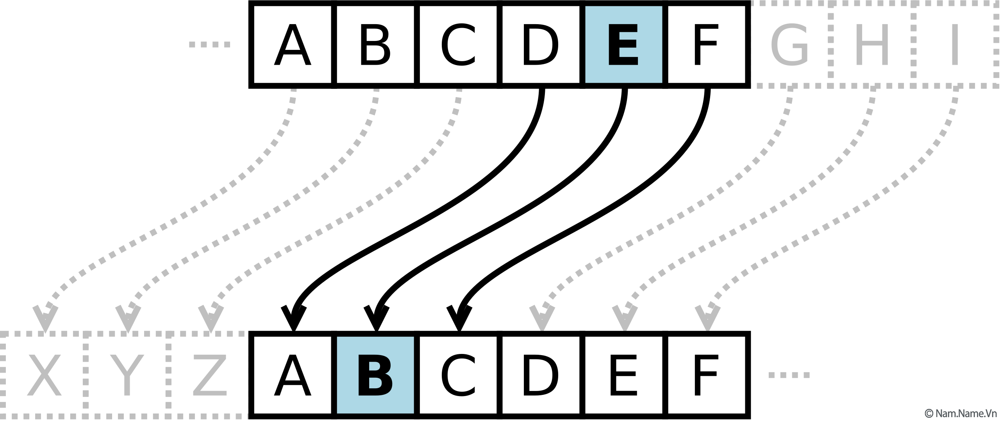
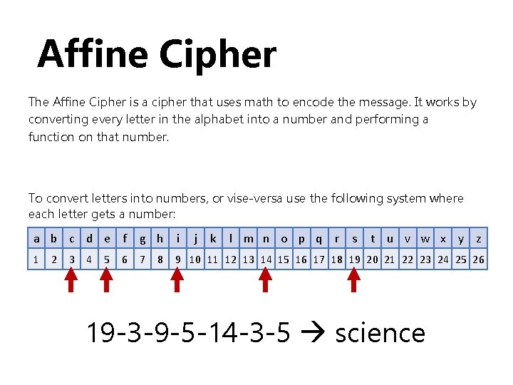
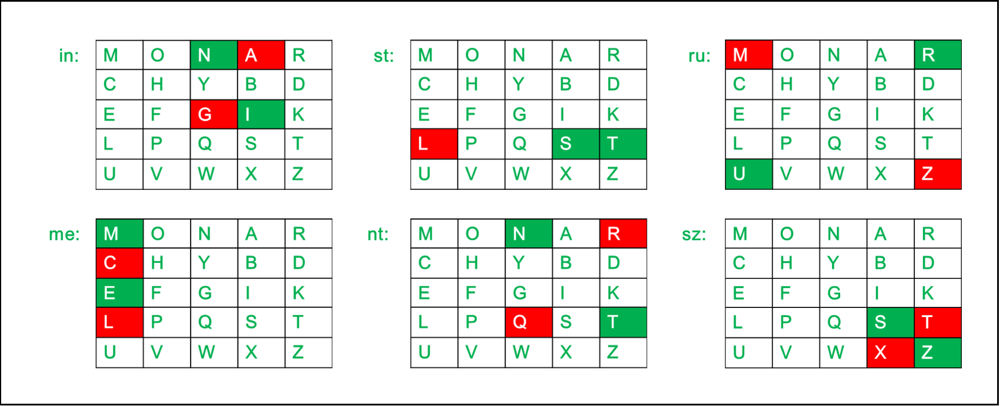
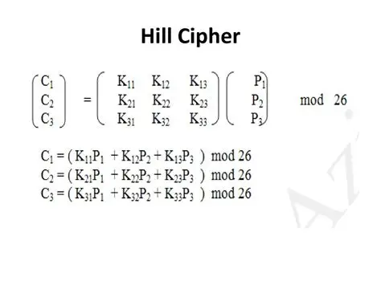

---
# Thuật toán mật mã cổ điển
Thuật toán mật mã cổ điển là các phương pháp mã hóa ra đời sớm, chủ yếu trước thời kỳ xuất hiện máy tính hiện đại, nó dựa trên toán học đơn giản và xử lý ký tự (chữ cái), thường để che giấu nội dung hơn là bảo mật.

👉 Các thuật toán này thường sử dụng:
- Bảng chữ cái A-Z
- Phép thay thế (substitution) hoặc hoán vị (transposition)
- Không sử dụng khóa lớn hay phép toán phức tạp

Tuy nhiên, dễ bị phá bằng phân tích tần suất (frequency analysis)

📌 Mục đích chính:
- Truyền tin bí mật trong quân sự, ngoại giao
- Và là nền tảng để hiểu mật mã học hiện đại

# Tìm hiểu một số loại mật mã học cổ điển
| Thuật toán     | Thuộc loại                   | Mô tả                                     |
| -------------- | ---------------------------- | ----------------------------------------- |
| Caesar         | Substitution                 | Dịch chữ cái cố định                      |
| Affine         | Substitution                 | Công thức toán học tuyến tính             |
| Vigenere       | Polyalphabetic Substitution  | Dùng nhiều bảng Caesar                    |
| Playfair       | Digraph Substitution         | Mã hóa theo cặp chữ cái                   |
| Hill           | Matrix-based Substitution    | Thay thế dựa trên ma trận                 | 

Chúng ta sẽ tìm hiểu 5 loại thuật toán này dựa trên các tiêu chí sau:
- Nguyên lý hoạt động
- Cách thức mã hóa - giải mã
- Các điểm yếu bảo mật

## 1. Caesar

### 🔹Nguyên lý hoạt động:  
Caesar là thuật toán thay thế đơn bảng. Mỗi chữ cái được dịch đi một số bước cố định so với bảng chữ cái gốc.

### 🔹Mã hóa  
- E(x) = (x + k) mod 26

Ví dụ:  
- Chọn khóa k = 3
- Quy ước A = 0, B = 1,..., Z = 25  
- Plaintext: **HELLO**

| Chữ gốc | Giá trị   | +3 | Chữ mã hóa |
|---------|-----------|----|------------|
| H       | 7         | 10 | K          |
| E       | 4         | 7  | H          |
| L       | 11        | 14 | O          |
| L       | 11        | 14 | O          |
| O       | 14        | 17 | R          |

> 👉 Ciphertext: **KHOOR**  

### 🔹Giải mã:  
- D(x) = (x - k) mod 26

Ví dụ:  
- Ciphertext: **KHOOR**
- Khóa: k = 3

| Chữ mã hóa | Giá trị   | +3 | Chữ gốc |
|------------|-----------|----|---------|
| H          | 10        | 7  | H       |
| E          | 7         | 4  | E       |
| L          | 14        | 11 | L       |
| L          | 14        | 11 | L       |
| O          | 17        | 14 | O       |

> 👉 Plaintext: **HELLO**

### 🔹Điểm yếu bảo mật:
- Không gian khóa rất nhỏ (25 khóa)
- Dễ dễ brute-force
- Phân tích tần suất phá được ngay

## 2. Affine Cipher

### 🔹Nguyên lý hoạt động
Affine là mở rộng của Caesar, sử dụng hàm tuyến tính thay vì chỉ dịch cố định. Mỗi chữ cái được ánh xạ thông qua hai tham số a và b.

Trong đó: 
- a phải nguyên tố cùng nhau với 26 (gcd(a, 26)=1)
- b là hằng số dịch

### 🔹Mã hóa
- E(x) = (ax + b) mod 26

Ví dụ:
- Chọn khóa: a = 5, b = 8  
- Quy ước: A = 0, B = 1, ..., Z = 25
- Plaintext: **HELLO**

| Chữ gốc | Giá trị | (5x + 8) mod 26 | Chữ mã hóa |
| ------- | ------- | --------------- | ---------- |
| H       | 7       | 17              | R          |
| E       | 4       | 2               | C          |
| L       | 11      | 11              | L          |
| L       | 11      | 11              | L          |
| O       | 14      | 0               | A          |

> 👉 Ciphertext: RCLLA

### 🔹Giải mã
- D(x) = a-1(x - b) mode 26  
- Trong đó a-1 là nghịch đảo modulo 26 của a

Với a = 5 => a-1 = 21 vì 5.21 = 1 (mod 26)  
Có R = 17,
- x = 21(17-8) mod 26 = 21.9 mod 26 = 189 mod 26 = 7 => H  
> Giải tương tự ta sẽ dò ra được chuỗi gốc là : **HELLO**

### 🔹Điểm yếu bảo mật
- Vẫn là thay thế đơn bảng
- Dễ bị phân tích tần suất (frequency analysis)
- Không gian khóa nhỏ

## 3. Vigenère

### 🔹Nguyên lý hoạt động
### 🔹Mã hóa
### 🔹Giải mã
### 🔹Điểm yếu bảo mật

## 4. Playfair

### 🔹Nguyên lý hoạt động
### 🔹Mã hóa
### 🔹Giải mã
### 🔹Điểm yếu bảo mật

## 5. Hill

### 🔹Nguyên lý hoạt động
### 🔹Mã hóa
### 🔹Giải mã
### 🔹Điểm yếu bảo mật=
